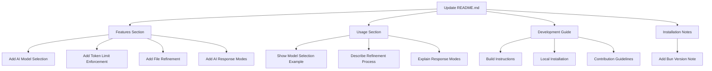

# README Update Plan



## 1. Features Section Updates
- **AI Model Selection**: Add description of the `-m, --model <alias>` option and supported models ("2" for `gemini-2.0-flash-001`, "2.5" for `gemini-2.5-flash-preview-05-20`)
- **Prompt Token Limit Enforcement**: Explain the MAX_AI_TOKENS limit (1,000,000 tokens) and how it prevents excessive usage
- **File Refinement**: Describe how users can refine the initial file list by providing additional comments
- **AI Response Modes**: Differentiate between "Diff Mode" and "Normal Mode" when copying file content

## 2. Usage Section Expansion
- Add command example with model selection:
  ```bash
  bun run cli -m 2.5
  ```
- Describe the refinement process after initial file identification
- Explain response mode selection during file content copying

## 3. Development Guide
- **Building the Project**:
  ```bash
  bun run build
  ```
- **Local Installation**:
  ```bash
  bun run install
  ```
- **Contribution Guidelines**: Brief note about:
  - Following existing coding standards
  - Using Biome for linting and formatting
  - Keeping documentation updated

## 4. Installation Notes
- Add recommended Bun version based on peer dependencies in package.json

## Implementation Notes
1. Keep content concise as requested
2. Maintain consistent formatting with existing README
3. Add any necessary CLI screenshots in Usage section
4. Ensure all new features are accurately described