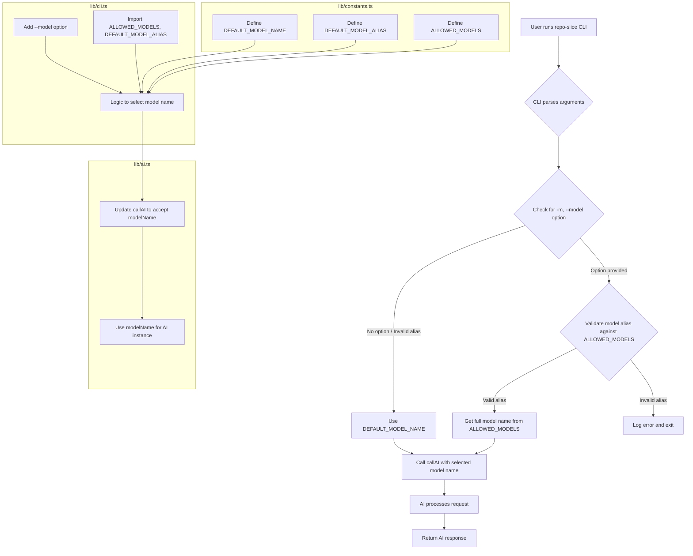

# Detailed Plan for Adding AI Model Selection

**Objective:** Implement a CLI option (`-m, --model`) to allow users to select between different Gemini models using aliases, with a default model set.

**Affected Files:**
1.  [`lib/constants.ts`](lib/constants.ts): To define the allowed models and their aliases.
2.  [`lib/cli.ts`](lib/cli.ts): To add the new CLI option, validate user input, and use the selected model.
3.  [`lib/ai.ts`](lib/ai.ts): To use the selected model name instead of the default.

**Plan Steps:**

1.  **Modify `lib/constants.ts`**:
    *   Define a `Record<string, string>` named `ALLOWED_MODELS` that maps aliases to full model names.
        ```typescript
        export const ALLOWED_MODELS: Record<string, string> = {
          "2.5": "gemini-2.5-flash-preview-05-20",
          "2": "gemini-2.0-flash-001",
        };
        ```
    *   Update `DEFAULT_MODEL_NAME` to use the alias `2` and retrieve the full name from `ALLOWED_MODELS`.
        ```typescript
        export const DEFAULT_MODEL_ALIAS = "2";
        export const DEFAULT_MODEL_NAME = ALLOWED_MODELS[DEFAULT_MODEL_ALIAS];
        ```

2.  **Modify `lib/cli.ts`**:
    *   Import `ALLOWED_MODELS` and `DEFAULT_MODEL_ALIAS` from `lib/constants.ts`.
    *   Add a new option to the `program` using `.option()` for `-m, --model <alias>`.
    *   In the `program.action` block:
        *   Retrieve the `modelAlias` from the parsed options.
        *   If `modelAlias` is provided, validate it against `ALLOWED_MODELS`. If invalid, log an error and exit.
        *   Determine the `selectedModelName`: if `modelAlias` is valid, use `ALLOWED_MODELS[modelAlias]`; otherwise, use `DEFAULT_MODEL_NAME`.
        *   Pass the `selectedModelName` to the `callAI` function.

3.  **Modify `lib/ai.ts`**:
    *   Update the `callAI` function signature to accept a `modelName` parameter.
    *   Use the `modelName` parameter when creating the `google` model instance, instead of `DEFAULT_MODEL_NAME`.

**Mermaid Diagram:**



**Example Usage (after implementation):**

*   `repo-slice -m 2.5` will use `gemini-2.5-flash-preview-05-20`.
*   `repo-slice -m 2` will use `gemini-2.0-flash-001`.
*   `repo-slice` (no model option) will use `gemini-2.0-flash-001` (default).